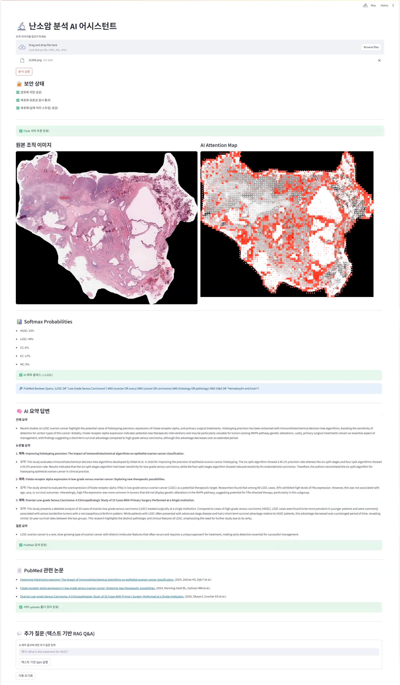
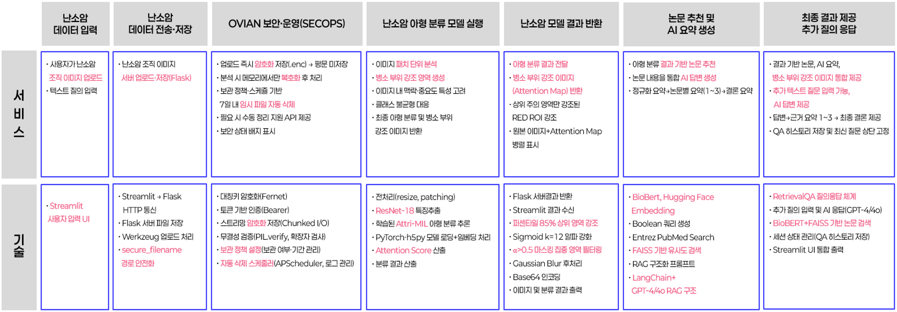

# OVIAN: An AI-Assisted Clinical Decision Support Solution for Ovarian Cancer Subtyping

OVIAN은 난소암 조직 병리 이미지(Whole Slide Image, WSI)의 아형(Subtype) 분류를 보조하고, 판독 효율성 향상 및 의사 간 진단 편차(Inter-observer variability) 완화를 목적으로 설계된 연구용 **의사결정 보조(Clinical Decision Support) 솔루션**입니다. 

본 시스템은 단일 모델 검증을 넘어 **[데이터 전처리 ➔ 모델 학습 ➔ 추론 및 시각화 ➔ RAG 기반 문헌 검색 ➔ UI 대시보드 ➔ 인메모리 보안 및 백엔드 라이프사이클 관리]**까지 전 파이프라인이 유기적으로 통합된 결합형 아키텍처를 가집니다.



---

## 💡 Clinical Motivation & Design Evolution

### 1. 임상적 문제의식 (Addressing Inter-Observer Variability)
난소암의 5대 아형(HGSC, LGSC, CC, EC, MC) 분류는 병소 부위의 경계가 모호하여 병리학자의 육안 진단 시 의사 간 판정 범위나 아형 진단에 편차가 발생하기 쉽고, 대용량 WSI를 전수 조사하는 데 많은 판독 시간이 소요됩니다. OVIAN은 진단 오류 가능성을 낮추고 판독 지연(Diagnostic Latency)을 줄이기 위한 의사결정 보조 도구로 기획되었습니다.

### 2. 피드백 기반 시스템 고도화 (Jury Feedback Integration)
* **SecOps 아키텍처 도입:** 예선 심사 의료진의 '의료 데이터 보안 및 연구 윤리 강화' 피드백을 반영하여, `Fernet` 대칭키 암호화 및 디스크 평문 저장 배제 로직을 본선 파이프라인에 추가 설계했습니다.
* **Attention Map 시인성 개선:** 기존 그라데이션 컬러맵이 병소 경계를 모호하게 만든다는 지적을 수용하여, **85th Percentile 임계값 필터링 기반의 고대비 White-to-Red 맵**으로 렌더링 수식을 수정하여 판독 가독성을 보완했습니다.

---

## 📌 Key Engineering & Research Focus

### 1. Advanced Weakly-Supervised Learning (AttriMIL)
* **Gated Attention Mechanism:** 세포 단위의 세밀한 픽셀 레이블링 없이 슬라이드 전체 라벨만으로 데이터 연산을 유도하는 Gated Attention 구조를 채택했습니다.
* **Attribute-based Aggregation:** 각 패치별 인스턴스 점수에 `exp(attention)`을 결합하여 특정 아형 확정에 기여한 **Attribute Score**를 정밀하게 도출하며, 이는 시각적 판단 근거(XAI)가 됩니다.
* **Spatial & Rank Constraints:** 인접 패치 간 공간적 연속성을 반영하는 Spatial 스무딩 제약과 판정 일관성을 위한 Rank 제약 조건을 커스텀 손실 함수(Loss)로 결합하여 모델의 강건성을 확보했습니다.

### 2. Context-Aware Medical RAG Pipeline
* **Template-based Query Orchestration:** AI 모델의 확신도(Softmax 확률 $\ge$ 35%)와 연동되어, **GPT-4-assisted template-based PubMed Boolean 검색 쿼리(AND, OR, 괄호 조합)**를 실시간으로 생성합니다.
* **BioBERT & FAISS Vector DB:** 실시간 수집된 NCBI PubMed 논문 초록 데이터를 의료 특화 언어 모델인 **BioBERT**로 임베딩한 후, **FAISS 인메모리 벡터 DB**를 구축합니다.
* **Retrieval-Based Literature Summary:** LangChain `RetrievalQA` 체인을 거쳐 의료진에게 [전체 트렌드 요약 / 논문별 핵심 요약(출처 3개 명시) / 최종 결론] 형태의 구조화된 **검색 기반 문헌 요약(Retrieval-based summary)**을 대시보드에 제공합니다.

### 3. Medical Data Security & Stream Operations (SecOps)
* **In-Memory Stream Processing:** 업로드 즉시 `Fernet` 대칭키 암호화를 수행하여 디스크에는 오직 `.enc` 상태로만 보관하며, 추론 시에는 디스크에 평문을 남기지 않고 메모리 상에서 **`BytesIO` 스트림 방식으로 복호화 및 패치 연산**을 수행합니다.
* **Automated Data Lifecycle:** 추론 완료 즉시 임시 특징 파일(.h5)을 파기하며, 백엔드에서는 **APScheduler**가 주기적으로 자동 구동되어 보관 정책(7일)이 만료된 암호화 데이터를 완전히 소거합니다.

---

## 🏗️ Solution Architecture


*(※ 본 시스템은 대용량 비전 연산을 처리하는 AI 백엔드(Flask)와 의료진 인터페이스 UI(Streamlit)가 독립적으로 결합된 분리형 아키텍처(Decoupled Inference-Service Architecture)로 구동됩니다.)*

---

## 📊 Experimental Settings & Quantitative Results

본 시스템의 백엔드 분류 모델은 다음과 같은 연구 환경 하에 학습 및 대조 검증이 진행되었습니다.

### 1. Experimental Environments
* **Dataset Source:** Kaggle UBC-OCEAN (Ovarian Carcinoma Subtype Classification)
* **Data Scale:** Whole Slide Images (WSI) processed into **$256 \times 256$ pixels Patches**
* **Patch Strategy:** Background filtering via `BLACK_THRESHOLD(0.95)` & `WHITE_THRESHOLD(0.99)`
* **Feature Extractor:** **ResNet-18 Backbone** (Pretrained on ImageNet, final FC removed $\rightarrow$ 512-d Vector)
* **Validation Strategy:** **Stratified 5-Fold Cross-Validation** (To handle heavy class imbalance of subtypes)
* **Optimization:** SGD Optimizer (LR = 2e-4, Momentum = 0.9, Weight Decay = 1e-5), Max 15 Epochs
* **Hardware Environment:** NVIDIA RTX 4090 / CUDA 12.x / PyTorch 2.x

### 2. Quantitative Evaluation & Baseline Comparison
Under weakly-supervised ovarian subtype classification settings 환경 조건 하에, 가중치 초기화 상태(Random Init)와 학습 완료 상태(Trained)의 정량적 메트릭 대조 결과는 다음과 같습니다.

* **Random Initialization (Baseline)**
  * Classification Accuracy: **8.0%**
  * Area Under ROC (AUROC): **0.49**
* **Trained AttriMIL Model (OVIAN)**
  * Classification Accuracy: **62.0%**
  * Area Under ROC (AUROC): **0.84**

Highly imbalanced multi-class subtype settings 조건 하에서 무작위 상태 대비 메트릭 향상을 확인하였으며, 혼동 행렬(Confusion Matrix) 분석 결과 HGSC, CC 등 주요 암 아형 클래스에서 안정적인 변별력을 증명했습니다.

---

## 🛠️ Environment Setup & Execution

### 1. Conda Environment Configuration
아래 명령어를 통해 연구 및 구동 환경을 구축합니다.
```bash
# Clone the repository
git clone https://github.com/your-username/OVIAN.git
cd OVIAN

# Create environment from yml
conda env create -f ovian.yml
conda activate rovian

# Install production dependencies
pip install -r requirements.txt
```

### 2. Run Application (Decoupled Backend-Frontend Execution)
본 시스템은 API 서버와 UI 프론트엔드가 병렬 구동됩니다. 두 개의 터미널(Terminal)을 열고 각각 실행하십시오.

* **Terminal 1: Launch Flask Inference Core**
  ```bash
  python flask_server.py
  ```
* **Terminal 2: Launch Streamlit Web UI Dashboard**
  ```bash
  streamlit run main.py
  ```

---

## ⚠️ Limitations & Future Work

### Limitations
* The highlighted attention regions have not yet undergone cross-validation with board-certified pathologists.
* The literature summarization pipeline was designed with retrieval-grounded prompts, but formal hallucination benchmarking (e.g., RAGAS, TruLens) has not yet been conducted.
* The current system was evaluated primarily on publicly available ovarian histopathology datasets and may require additional external validation for broader clinical generalization.

### Future Work
* Clinician-in-the-loop validation of attention regions with pathology experts to evaluate exact tumor microenvironment alignment.
* Quantitative evaluation of retrieval faithfulness and answer relevance for the RAG pipeline.
* Expansion toward multi-cancer histopathology support.
* Integration of additional biomedical literature sources beyond PubMed.

---

## 📂 Project Repository Structure

```text
OVIAN/
├── Model training/    # Stratified 5-Fold splits, Custom Samplers, and training loops
├── models/            # Neural network architecture definitions (AttriMIL, Gated Attention)
├── save_weights/      # Pretrained weights directory (attrimil_final.pth)
├── main.py            # Streamlit web interface & LangChain-FAISS RAG pipeline
├── flask_server.py    # Flask API core, Fernet encryption, and APScheduler manager
├── infer.py           # Feature extraction, neighbor graph computation, and XAI rendering
├── ovian.yml          # Conda environment settings
└── requirements.txt   # Pinpointed python dependencies
```
